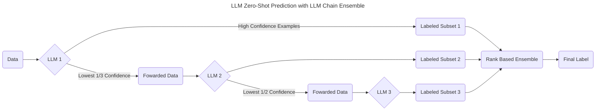

# LLM Chain Ensembles for Efficient Zero-Shot Prediction

This repository contains the code for [LLM Chain Ensembles](google.com). Confidence chaining strings together LLMs as a chain of classifiers using uncertainty estimates to select subsets of data to foward to the next model in the chain. This method reduces zero-shot prediction costs by exposing limited data to high-cost models at the end of the chain and can yeild increased performance. 



## Python Scripts and Modules

### LLM Chain

To run an example chain ensemble we provide an python script in [llm_chain.py](./src/llm_chain.py) that runs a chain of LLama3-8B-instruct, Flan-UL2, and GPT-4o. The code has three command line arguments: 
- `-d` The dataset to use. The user is expected to enter "SemEval2016", "misinfo" or "ibc". The [SemEval2016](https://www.saifmohammad.com/WebPages/StanceDataset.htm) dataset is used for the stance detection task, the [misinfo](https://github.com/skgabriel/mrf-modeling) dataset is available for the misinformation detection task, and the [ibc](https://github.com/SALT-NLP/LLMs_for_CSS/tree/main/css_data/ibc) dataset is available for ideology detection task.
- `-o` The directory to output the chain results.
- `-n` The number of samples to select from said dataset. Specify -1 to use the entire dataset. Default is 10.

```bash
$ python llm_chain.py -d SemEval2016 -o ./chain_out -n 20
```

If you would like to make your own chain ensemble, [llm_chain.py](./src/llm_chain.py) file also provides a simple interface for doing so.

```python
import pandas as pd
from transformers import T5ForConditionalGeneration, AutoModelForCausalLM, BitsAndBytesConfig

from hf_link import HuggingFaceLink
from openai_link import OpenAILink
from llm_chain import LLMChain

data_df = pd.DataFrame({"prompts": ["Im against something", "Im for something"], 
                        "Stance": ["against", "for"]})
labels = ["for", "against", "neutral"]

llama_link = HuggingFaceLink(model_name = "meta-llama/Meta-Llama-3.1-8B-Instruct", 
                             model_class = AutoModelForCausalLM, 
                             labels = labels,
                             quantization_config = BitsAndBytesConfig(load_in_8bit=True))
flan_link = HuggingFaceLink(model_name = "google/flan-ul2", 
                            model_class = T5ForConditionalGeneration, 
                            labels = labels, 
                            quantization_config = BitsAndBytesConfig(load_in_8bit=True))
gpt4_link = OpenAILink(model_name="gpt-4o", labels = labels)

links = [llama_link, flan_link, gpt4_link]
llm_chain = LLMChain(links)
data_out = llm_chain.run_chain(data_df, "./chain_out", CoT = [False, False, False])
```

### Labeling Entire Datasets and Simulating Chain Ensembles

We also provide an interface for labeling entire datasets with LLMs and analyzing their results post-hoc to run simulations of chain ensembles. To label entire datasets we provide a python script in [llm_label.py](./src/llm_label.py) that runs with the following command line arguments.
- `-m` The model to use to label the dataset. Select from  "flan-ul2", "llama3-8B-instruct", "phi3-medium", "mistral-7B-instruct", "gpt-4o", and "gpt-4o-mini".
- `-d` The dataset to label. The user is expected to enter "SemEval2016", "misinfo" or "ibc."
- `-o` The output directory to save labeled data.
- `-n` The number of samples to select from said dataset. Specify -1 to use the entire dataset. Default is 10.
- `q` Specify model quantization. Supported are "8" and "4" for 8 and 4 bit respectively. To load with full precision specify -q != 8 or 4. Default is  8.

```bash
python llm_label.py -m llama3-8B-instruct -d "SemEval2016" -o "./llama_test/" -n -1 -q 0
```

Once you have fully labeled datasets, you can run a simple simulation across them in a separate notebook or python script using the [chain_sim.py](./src/chain_sim.py) module. Set up the script with the following code. The documentation for each of these functions is available in [chain_sim.py](./src/chain_sim.py).

```python
import pandas as pd

from chain_sim import get_combinations, chain_dataframes, backward_pass

llama_link = pd.read_pickle("./llama_test/results_df.pkl")
flan_link =  pd.read_pickle("./flan_test/results_df.pkl")
gpt_link =  pd.read_pickle("./gpt_test/results_df.pkl")

links = [llama_link, flan_link, gpt_link]
names = ["llama", "flan", "gpt", "mistral", "phi"]
```

To run a sinle chain ensemble iteration, use the `chain_dataframes` and `backward_pass` functions.

```python
chained_df = chain_dataframes(links, "Stance")
ensembled_df = backward_pass(chained_df, len(links))
```

To run a chain ensemble for all length `3` permutations of our links run the `get_permutations` function.

```python
sim_results_df = get_permutations(links, names, 3, "Stance", n_trails=20, backward = True)
```

**Note:** We assume all datasets used in the simulation come from the labeling function. It's critical that model-specific datasets in the simulation are in the same order and have the requisite columns. If you are using the llm_label.py script, then this is handled for you automatically. 

### Authentication

Please note that each script requires either a Huggingface token or OpenAI API token. These are accessed via environmental variables. If you are running from the terminal, please set the following environmental variables.

```bash
$ export HF_TOKEN=your_hf_token_here!
$ export OPENAI_API_TOKEN=your_openai_token_here!
```

If you are using our software as a python module in a notebook or your own script, you can set the environmental variables in python with he following code chunk.

```python
import os
os.environ["HF_TOKEN"] = "your_hf_token_here!"
os.environ["OPENAI_API_KEY"] = "your_openai_token_here!"
```
